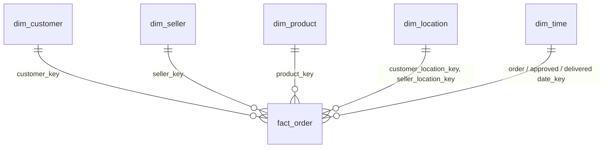

# Olist E-Commerce Data Pipeline

An end-to-end batch pipeline that turns the [Olist Brazilian E-Commerce dataset](https://www.kaggle.com/datasets/olistbr/brazilian-ecommerce) into a star-schema data warehouse. Raw CSVs move through a bronze → silver → gold (medallion) layer with PySpark, are loaded into PostgreSQL, validated, and exposed through analytics views. Apache Airflow orchestrates every step, and everything runs locally with Docker Compose.

## Architecture

```
Raw CSVs (Olist)                raw_layer/<entity>/ingestion_date=YYYY-MM-DD/*.csv
        │
        ▼
  Bronze   bronze_stage.py      CSV → Parquet, all columns as strings, adds
  (Spark)                       processed_at + batch_ingest_date
        │
        ▼
  Silver   silver_stage.py      Type casting, column selection/renaming,
  (Spark)                       de-duplication
        │
        ▼
  Gold     gold_stage.py        Dimensions + fact table with date keys
  (Spark)                       (star-schema shaped Parquet)
        │
        ▼
  Load     loadscript.py        Upserts dimensions, resolves surrogate keys
  (PostgreSQL)                  via SQL joins, upserts the fact table
        │
        ▼
  Quality  quality_checks.py    Row counts, nulls, referential integrity;
  checks                        exits non-zero on failure → task fails
        │
        ▼
  Views    refresh_views.py     Refreshes pre-aggregated analytics views
        │
        ▼
  Orchestrated by Airflow       dags/pipeline.py  (DAG: olist_etl_pipeline)
```

| Layer | Location | Contents |
|-------|----------|----------|
| Raw | `raw_layer/` | Source CSVs, one folder per entity per ingestion date |
| Bronze | `bronze_layer/<entity>/batch_ingest_date=…` | Parquet copy of the CSV (strings), plus lineage columns |
| Silver | `silver_layer/<entity>/batch_ingest_date=…` | Typed, de-duplicated data |
| Gold | `gold_layer/<table>/` | `dim_*` and `fact_order` Parquet files ready to load |
| Warehouse | PostgreSQL `ecommerce_dw` | Star schema + analytics views |

## Warehouse schema



| Table | Grain / description |
|-------|---------------------|
| `fact_order` | One row per order item. Keys to every dimension plus measures: price, freight, payment type/installments/value, review score, order status. Primary key `(order_id, order_item_id)` |
| `dim_customer` | Customer with `zip_code_prefix` (natural key `customer_id`) |
| `dim_seller` | Seller with `zip_code_prefix` (natural key `seller_id`) |
| `dim_product` | Product catalog with English category name (`unknown` when untranslated) |
| `dim_location` | One row per zip-code prefix: city, state, average latitude/longitude |
| `dim_time` | Calendar breakdown (`date_key` = `yyyyMMdd`) built from purchase, approval and delivery dates |

Customers and sellers store only a zip prefix. The fact table's `customer_location_key` and `seller_location_key` are resolved at load time by joining on `dim_location.zip_code_prefix`.

> **Analytics note:** payment fields and `review_score` are order-level values repeated on every item row of an order. Deduplicate by `order_id` before summing `payment_value`.

## Tech stack

| Tool | Purpose |
|------|---------|
| PySpark 3.5.3 (standalone cluster) | Bronze/silver/gold transformations |
| PostgreSQL 16 | Data warehouse (and Airflow metadata DB) |
| Apache Airflow 3 | Orchestration and scheduling |
| Docker Compose | Local infrastructure |
| pandas + `PostgresHook` | Loading Parquet files into PostgreSQL |
| pgAdmin | Browsing the warehouse |

## Project structure

```
.
├── dags/
│   └── pipeline.py            # Airflow DAG
├── spark-jobs/
│   ├── bronze_stage.py
│   ├── silver_stage.py
│   └── gold_stage.py
├── src/
│   ├── loadscript.py          # Parquet → PostgreSQL
│   ├── quality_checks.py
│   └── refresh_views.py
├── sql/
│   └── init_warehouse.sql     # Star-schema DDL
├── raw_layer/                 # Input CSVs (not committed)
├── bronze_layer/              # Generated
├── silver_layer/              # Generated
├── gold_layer/                # Generated
├── Dockerfile                 # Airflow image: Spark provider, JRE, pyspark, pandas
├── docker-compose.yml
├── .env                       # Secrets (not committed)
└── .env.example
```

## Input data layout

The pipeline reads one folder per entity, partitioned by ingestion date. It does not create these folders. Put the files there before running the DAG.

```
raw_layer/
├── customer/ingestion_date=2026-09-25/olist_customers_dataset.csv
├── geolocation/ingestion_date=2026-09-25/olist_geolocation_dataset.csv
├── order/ingestion_date=2026-09-25/olist_orders_dataset.csv
├── order_item/ingestion_date=2026-09-25/olist_order_items_dataset.csv
├── order_payment/ingestion_date=2026-09-25/olist_order_payments_dataset.csv
├── order_review/ingestion_date=2026-09-25/olist_order_reviews_dataset.csv
├── product/ingestion_date=2026-09-25/olist_products_dataset.csv
├── seller/ingestion_date=2026-09-25/olist_sellers_dataset.csv
└── category_translation/ingestion_date=2026-09-25/product_category_name_translation.csv
```

The date in the folder name must be zero-padded (`YYYY-MM-DD`) and must match the date the DAG run resolves `{{ ds }}` to (see [Running the pipeline](#running-the-pipeline)).

## Getting started

**Prerequisites:** Docker with Compose v2, and the Olist CSVs.

1. **Create your `.env`** next to `docker-compose.yml` (copy `.env.example`). Both values must stay fixed across restarts:

   ```
   AIRFLOW__API_AUTH__JWT_SECRET=<random string>
   AIRFLOW__CORE__FERNET_KEY=<fernet key>
   ```

   ```bash
   # Fernet key
   python -c "from cryptography.fernet import Fernet; print(Fernet.generate_key().decode())"
   # JWT secret
   python -c "import secrets; print(secrets.token_urlsafe(48))"
   ```

2. **Add the raw data** under `raw_layer/` as shown above.

3. **Start the stack**

   ```bash
   docker compose up -d --build
   ```

4. **Create the warehouse schema** (first run only, since the database starts empty):

   ```bash
   docker exec -i commerce-postgresdsarea psql -U commerce -d ecommerce_dw < sql/init_warehouse.sql
   ```

   To create it automatically on a fresh database instead, mount the file into the `commerce-postgres` service:
   `- ./sql/init_warehouse.sql:/docker-entrypoint-initdb.d/01_init.sql`
   (Postgres only runs init scripts when its data volume is empty.)

5. **Log in to Airflow** at http://localhost:8081 (development default: `admin` / `admin`) and create two connections under **Admin → Connections**:

   | Conn Id | Type | Host | Port | Other |
   |---------|------|------|------|-------|
   | `spark_default` | Spark | `spark://spark-master` | `7077` | |
   | `olistdbid` | Postgres | `commerce-postgres` | `5432` | Schema `ecommerce_dw`, login/password `commerce` |

6. **Unpause and trigger** the `olist_etl_pipeline` DAG.

### Services and ports

| Service | URL / port |
|---------|-----------|
| Airflow UI | http://localhost:8081 |
| Spark master UI | http://localhost:8082 |
| Spark worker UI | http://localhost:8083 |
| Spark master (submit) | `localhost:7077` |
| pgAdmin | http://localhost:5050 |
| Warehouse (`commerce-postgres`) | `localhost:5475` |
| Airflow metadata DB | `localhost:5478` |

## Running the pipeline

The DAG runs daily at 01:00 (`0 1 * * *`). Tasks run in order:

| Task | Operator | What it does |
|------|----------|--------------|
| `transform_bronze` | SparkSubmit | CSV → Parquet for all nine entities |
| `transform_silver` | SparkSubmit | Cast types, de-duplicate |
| `transform_gold` | SparkSubmit | Build dimensions and fact table |
| `load_warehouse` | Python | Upsert into PostgreSQL |
| `quality_checks` | Python | Validate the loaded data |
| `refresh_analytics_views` | Python | Refresh analytics views |

Each Spark stage takes `--data-path`, `--output-path`, `--ingest-date` and an optional `--only <entity>` to reprocess a single entity.

**Choosing the ingestion date.** Every stage receives `{{ ds }}`, the **UTC date** of the run's logical date. When you trigger manually, the Airflow UI may show and accept times in your local timezone. With a 01:00 schedule and a timezone ahead of UTC, that converts to the previous UTC day (for example, 01:00 on the 26th at UTC+7 is the 25th in UTC). Either switch the UI to UTC before triggering or pick the date accordingly, then check the first Spark log line (`--ingest-date …`).

### Idempotency

- Bronze, silver and gold delete the target `batch_ingest_date` partition before rewriting it, so re-running a date is safe.
- Dimensions are upserted on their natural keys and the fact table on `(order_id, order_item_id)`, so reloads do not create duplicates.

## Design notes

- **Python steps run inside Airflow, not in a shell.** Airflow 3 tasks do not have direct access to the metadata database, so `load_warehouse`, `quality_checks` and `refresh_analytics_views` run through `PythonOperator` (see `run_script` in `pipeline.py`). That lets `PostgresHook(postgres_conn_id="olistdbid")` resolve the connection through Airflow's Execution API. Running the scripts with `BashOperator` fails when they import Airflow.
- **Spark runs in client mode.** `spark-submit` is executed from the Airflow container (which ships a JRE and `pyspark`), so the driver runs there and executors run in `spark-worker`. Raw/bronze/silver/gold folders are bind-mounted into Airflow, `spark-master` and `spark-worker` at the same paths.
- **All containers run as root** so files written by the executors can be renamed and cleaned up by the driver on the shared bind mounts. This is for local development only.
- **Fixed secrets.** `AIRFLOW__CORE__FERNET_KEY` and `AIRFLOW__API_AUTH__JWT_SECRET` come from `.env` and are shared by every Airflow service. A changing Fernet key makes stored connections unreadable.

## Troubleshooting

| Symptom | Likely cause and fix |
|---------|----------------------|
| DAG is green but nothing was produced; log says `no file found for … at …/ingestion_date=…` | Bronze skips entities whose raw folder for that date is missing, without failing. Fix the folder name or the logical date |
| `spark-submit --master yarn` and `Could not load connection string spark_default` | The `spark_default` connection does not exist. Recreate it (see step 5) |
| Connections page returns a 500 (`InvalidToken`), or connections vanished | The Fernet key changed, or the database volume was wiped. Keep the key fixed in `.env` and avoid `docker compose down -v`, which deletes **all** volumes, including the warehouse |
| Task fails immediately with `Connection refused` to the execution API | `AIRFLOW__CORE__EXECUTION_API_SERVER_URL` and `AIRFLOW__API_AUTH__JWT_SECRET` must be set identically on the scheduler, dag-processor and api-server |
| `relation "dim_location" does not exist` | The warehouse schema has not been created. Run `sql/init_warehouse.sql` |
| `UnknownHostException: spark-master` | The Spark containers are not running. Check `docker compose ps` |
| `Failed to rename … _temporary` when writing Parquet | Containers writing to the same bind mount are running as different users. Run them all as the same user |
| `ON CONFLICT DO UPDATE command cannot affect row a second time` | Duplicate `(order_id, order_item_id)` in the fact staging data. The load keeps one row per key with `DISTINCT ON`; check the gold layer for the source of duplicates |

## Resetting

| Command | Effect |
|---------|--------|
| `docker compose down` then `docker compose up -d` | Normal restart. Keeps the Airflow database (connections) and the warehouse |
| `docker compose down -v` | Wipes both databases. You will need to recreate the schema and both Airflow connections |
