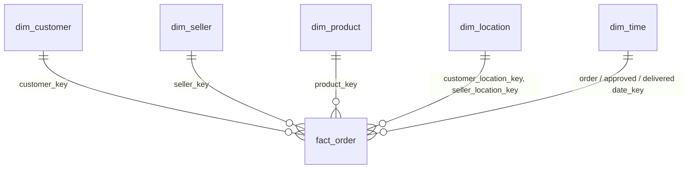

# Olist E-Commerce Data Pipeline

An end-to-end batch pipeline that turns the [Olist Brazilian E-Commerce dataset](https://www.kaggle.com/datasets/olistbr/brazilian-ecommerce) into a star-schema data warehouse. Raw CSVs move through a bronze → silver → gold (medallion) layer with PySpark, are loaded into PostgreSQL, validated, and exposed through analytics views. Apache Airflow orchestrates every step, and everything runs locally with Docker Compose.

## Architecture

```
Raw CSVs (Olist)                raw_layer/<entity>/ingestion_date=YYYY-MM-DD/*.csv
        │
        ▼
  Bronze   bronze_stage.py      CSV → Parquet, all columns as strings, adds
  (Spark)                       processed_at + batch_ingest_date
        │
        ▼
  Silver   silver_stage.py      Type casting, column selection/renaming,
  (Spark)                       de-duplication
        │
        ▼
  Gold     gold_stage.py        Dimensions + fact table with date keys
  (Spark)                       (star-schema shaped Parquet)
        │
        ▼
  Load     loadscript.py        Upserts dimensions, resolves surrogate keys
  (PostgreSQL)                  via SQL joins, upserts the fact table
        │
        ▼
  Quality  quality_checks.py    Row counts, nulls, referential integrity;
  checks                        exits non-zero on failure → task fails
        │
        ▼
  Views    refresh_views.py     Refreshes pre-aggregated analytics views
        │
        ▼
  Orchestrated by Airflow       dags/pipeline.py  (DAG: olist_etl_pipeline)
```

| Layer | Location | Contents |
|-------|----------|----------|
| Raw | `raw_layer/` | Source CSVs, one folder per entity per ingestion date |
| Bronze | `bronze_layer/<entity>/batch_ingest_date=…` | Parquet copy of the CSV (strings), plus lineage columns |
| Silver | `silver_layer/<entity>/batch_ingest_date=…` | Typed, de-duplicated data |
| Gold | `gold_layer/<table>/` | `dim_*` and `fact_order` Parquet files ready to load |
| Warehouse | PostgreSQL `ecommerce_dw` | Star schema + analytics views |

## Warehouse schema



| Table | Grain / description |
|-------|---------------------|
| `fact_order` | One row per order item. Keys to every dimension plus measures: price, freight, payment type/installments/value, review score, order status. Primary key `(order_id, order_item_id)` |
| `dim_customer` | Customer with `zip_code_prefix` (natural key `customer_id`) |
| `dim_seller` | Seller with `zip_code_prefix` (natural key `seller_id`) |
| `dim_product` | Product catalog with English category name (`unknown` when untranslated) |
| `dim_location` | One row per zip-code prefix: city, state, average latitude/longitude |
| `dim_time` | Calendar breakdown (`date_key` = `yyyyMMdd`) built from purchase, approval and delivery dates |

Customers and sellers store only a zip prefix. The fact table's `customer_location_key` and `seller_location_key` are resolved at load time by joining on `dim_location.zip_code_prefix`.

> **Analytics note:** payment fields and `review_score` are order-level values repeated on every item row of an order. Deduplicate by `order_id` before summing `payment_value`.

## Tech stack

| Tool | Purpose |
|------|---------|
| Apache Spark/PySpark 3.5.3 (standalone cluster) | Bronze/silver/gold transformations |
| PostgreSQL 16 | Data warehouse (and Airflow metadata DB) |
| Apache Airflow 3 | Orchestration and scheduling |
| Docker Compose | Local infrastructure |
| pandas + `PostgresHook` | Loading Parquet files into PostgreSQL |
| pgAdmin | Browsing the warehouse |

## Project structure

```
.
├── dags/
│   └── pipeline.py            # Airflow DAG
├── spark-jobs/
│   ├── bronze_stage.py
│   ├── silver_stage.py
│   └── gold_stage.py
├── src/
│   ├── loadscript.py          # Parquet → PostgreSQL
│   ├── quality_checks.py
│   └── refresh_views.py
│   └── analytics_views.sql
│   └── Createtable.sql
├── raw_layer/                 # Input CSVs (not committed)
├── bronze_layer/              # Generated
├── silver_layer/              # Generated
├── gold_layer/                # Generated
├── Dockerfile                 # Airflow image: Spark provider, JRE, pyspark, pandas
├── docker-compose.yml
├── .env                       # Secrets (not committed)
```
## Running the pipeline

The DAG runs daily at 01:00 (`0 1 * * *`). Tasks run in order:

| Task | Operator | What it does |
|------|----------|--------------|
| `transform_bronze` | SparkSubmit | CSV → Parquet for all nine entities |
| `transform_silver` | SparkSubmit | Cast types, de-duplicate |
| `transform_gold` | SparkSubmit | Build dimensions and fact table |
| `load_warehouse` | Python | Upsert into PostgreSQL |
| `quality_checks` | Python | Validate the loaded data |
| `refresh_analytics_views` | Python | Refresh analytics views |


